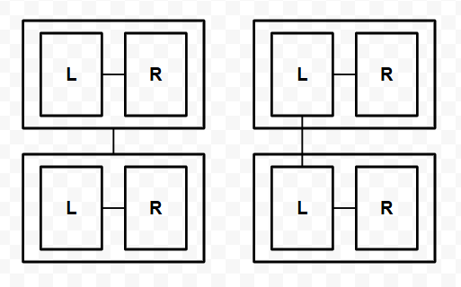
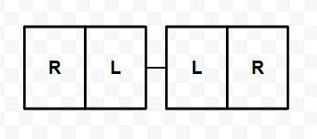
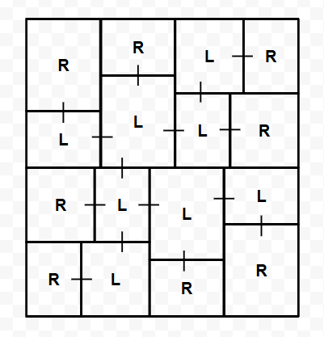

# BSP Dungeon Generation & Connectivity Control

## Overview

This document describes the design and implementation of the procedural dungeon generation system used in **Dungeon of Cursed**.

The system was built to solve a core problem:

- Ensuring full connectivity in a procedurally generated dungeon

While Binary Space Partitioning (BSP) is commonly used for dungeon generation,  
it does not inherently guarantee that all generated rooms are reachable.

This system extends BSP with additional constraints to ensure that all rooms are always connected.

## Problem: Connectivity in Random Generation

In a BSP-based dungeon, the space is recursively partitioned into smaller regions,  
with rooms generated in the leaf nodes. Corridors are typically created by connecting partitions:

- At each subtree, one room is selected from the left child and one room from the right child  
- A corridor is created between them

While this ensures that partitions are connected in principle, it does not guarantee that **all individual rooms are reachable**.  

The limitation arises from how connections are formed:

- **Leaf nodes** themselves can be connected without issues  
- Connections between non-leaf nodes (i.e., subtree-level connections) are ambiguous;  
  corridors may be created in positions that do not actually reach the contained rooms  
- This can result in unreachable or misaligned passages, leaving some rooms isolated  

To ensure full connectivity, connections must be made **directly between leaf nodes**, rather than between higher-level subtrees.

  

**Key Points**

1. Standard BSP connections are **subtree-centric**, not room-centric  
2. Internal node connections may produce unreachable corridors  
3. Full dungeon traversal requires **leaf-to-leaf connectivity**

## Key Idea: Leaf-to-Leaf Connection

To resolve the fundamental limitation of subtree-based connections in BSP,  
the system adopts a **leaf-to-leaf connection strategy**, shifting from partition-centric to room-centric connections.

Instead of connecting arbitrary rooms at the subtree level:

- Each subtree exposes a **representative leaf node**  
- This leaf node is selected based on a **directional rule**  

Corridors are then created **between these representative leaf nodes**, ensuring that:

- All connections occur between actual rooms  
- Connection positions are predictable and consistent  
- Subtrees can always be safely connected without leaving isolated rooms

## Representative Leaf Selection & Directional Rule

To guarantee full connectivity in a leaf-to-leaf BSP system,  
the dungeon generator implements a deterministic rule for selecting representative nodes and controlling connection directions.

### Representative Leaf Node

- Each subtree exposes a **representative leaf node** to serve as the connection point.  
- **Default selection:** the **leftmost leaf node at the deepest level** is chosen.  
- If the node itself is a leaf, it automatically becomes its own representative.  
- Connections are formed between the representative nodes of the **left and right subtrees**.  

> Ensuring that representative nodes are always **visible outside their subtree** is crucial,  
> as connections must be formed between exposed leaf nodes rather than through intermediate partitions.  

### Directional Rule (Ensuring Consistent Leaf Exposure)

  

To guarantee full connectivity in the leaf-to-leaf BSP system, representative leaf nodes must always be **exposed outward** for corridor connections.  
This is achieved through the **directional rule**, implemented via **axis inversion**:

- When a subtree is split along a given axis, the left child subtree is **always inverted along that axis**.  
- Directional flags (`hRev` for horizontal, `vRev` for vertical) are propagated through the BSP tree to maintain this orientation information.

### Effect of the Directional Rule

- Guarantees deterministic and valid connections between representative leaf nodes  
- Maintains **structural consistency** across recursive levels  
- **Ensures full connectivity** for all rooms with minimal per-node state (directional flags),  
  without requiring additional graph traversal or post-processing

  

### Implementation Note

To avoid degenerate layouts caused by excessive consecutive splits along the same axis,  
the implementation limits split depth per axis and forces an axis change when necessary.

## Summary

The system extends standard BSP dungeon generation with deterministic connectivity control:

- BSP provides the spatial structure  
- Leaf-to-leaf connection defines reliable room connectivity  
- Directional rules determine representative leaf selection  
- Direction propagation and inversion maintain consistent connectivity across recursive partitions  

Together, these elements ensure that all generated dungeons are both random and reliably connected.